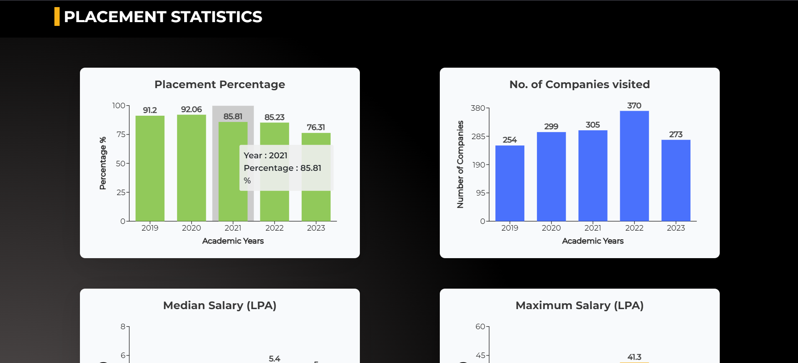

# 🚀 Placement Portal Website

## 🚀 Getting Started with Create React App

This project was bootstrapped with [Create React App](https://github.com/facebook/create-react-app).

## 📦 Available Scripts

In the project directory, you can run:

### `npm start`

Runs the app in development mode.\
Open [http://localhost:3000](http://localhost:3000) to view it in your browser.

- The page will reload when you make changes.
- You may also see any lint errors in the console.

### `npm test`

Launches the test runner in interactive watch mode.\
For more information, see the section about [running tests](https://facebook.github.io/create-react-app/docs/running-tests).

### `npm run build`

Builds the app for production to the `build` folder.\
It correctly bundles React in production mode and optimizes the build for the best performance.

- The build is minified, and the filenames include hashes.
- Your app is ready to be deployed!

For more on deployment, see [this section](https://facebook.github.io/create-react-app/docs/deployment).

### `npm run eject`

> **Note:** This is a one-way operation. Once you `eject`, you can't go back!

If you aren't satisfied with the build tool and configuration choices, you can `eject` at any time. This command will remove the single build dependency from your project.

- It will copy all the configuration files and transitive dependencies (webpack, Babel, ESLint, etc.) into your project, giving you full control over them.
- All other commands except `eject` will still work but will point to the copied scripts.

You don't have to use `eject`. The curated feature set is suitable for small and middle deployments, and you shouldn't feel obligated to use this feature.

## 📚 Learn More

You can learn more in the [Create React App documentation](https://facebook.github.io/create-react-app/docs/getting-started).

To learn React, check out the [React documentation](https://reactjs.org/).

### 🧩 Code Splitting

This section has moved here: [Code Splitting](https://facebook.github.io/create-react-app/docs/code-splitting).

### 📊 Analyzing the Bundle Size

This section has moved here: [Analyzing the Bundle Size](https://facebook.github.io/create-react-app/docs/analyzing-the-bundle-size).

### 📱 Making a Progressive Web App

This section has moved here: [Making a Progressive Web App](https://facebook.github.io/create-react-app/docs/making-a-progressive-web-app).

### ⚙️ Advanced Configuration

This section has moved here: [Advanced Configuration](https://facebook.github.io/create-react-app/docs/advanced-configuration).

### 🚀 Deployment

This section has moved here: [Deployment](https://facebook.github.io/create-react-app/docs/deployment).

### ⚠️ `npm run build` Fails to Minify

This section has moved here: [Troubleshooting](https://facebook.github.io/create-react-app/docs/troubleshooting#npm-run-build-fails-to-minify).

## 📸 Screenshots

- 
 
-  
   
- 
 
- 
 
- 
 
- 
 
- 

- 

## 📝 Tips for Better Understanding

- **Familiarize Yourself with JSX:** JSX is a syntax extension that looks similar to XML/HTML and is used with React to describe the UI.
- **Component-Based Architecture:** Understand how React applications are structured around components, which can be reused throughout your app.
- **State and Props:** Learn about the difference between state (data that can change) and props (data passed to components).
- **Lifecycle Methods:** Explore React component lifecycle methods to manage how components behave during their lifecycle (mounting, updating, unmounting).
- **Hooks:** If you're using functional components, familiarize yourself with Hooks like `useState` and `useEffect` for managing state and side effects.

Feel free to adjust or expand upon any sections to better fit your specific project details!
